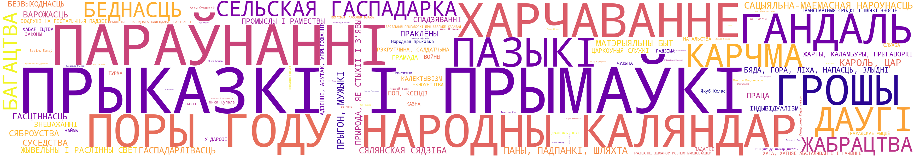
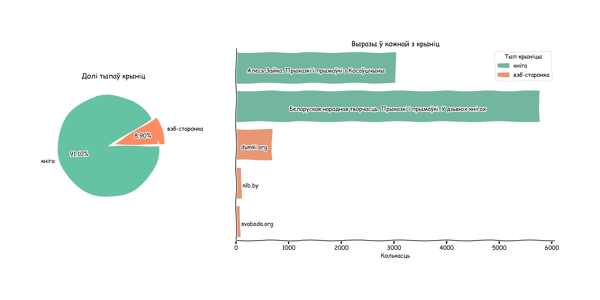

*English readme is [here](eng_readme.md).*
## Беларускія цытаты, прыказкі, прымаўкі       
Датасэт беларускіх выразаў, сабраны з адкрытых крыніц Інтэрнэта.  
Апошняя версія датасэта ляжыць **[тут](data/full_df_v_0.1.csv).**

Датасэт быў сабраны для **Notion**, каб кожны дзень атрымліваць выпадковую цытату.   
 
Глядзі тут --> 

---
#### Крыніцы
Дадзеныя былі сабраныя з:
1. вэб-старонак:   
   1.1. [Падборка цытат ад Радыё Свабоды](https://www.svaboda.org/a/24255332.html)  
   1.2. [Падборка ад Нацыянальнай бібліятэкі](https://www.nlb.by/by/infarmatsyynyya-resursy/elektronnyya-infarmatsyynyya-resursy/resursy-natsyyanalnay-bibliyateki-belarusi/virtualnyya-praekty-vysta-ki-i-kalektsyi/virtualnyya-praekty-bibliyateki/klasiki-susvetnay-litaratury-yanka-kupala-i-yakub-/vyslo-i-vykazvanni-afaryzmy-belaruskikh-pesnyaro)  
   1.3. [Цытаты з сайта dumki.org](dumki.org)
   
2. кніг фармата pdf:  
   2.1. [Беларуская народная творчасць. Прыказкі і прымаўкі. У дзьвюх частках](https://kamunikat.org/prykazki-i-prymawki-post-46436)  
   2.2. [Алесь Зайка. Прыказкі і прымаўкі з Косаўшчыны](https://knihi.com/Ales_Zajka/Prykazki_i_prymauki_z_Kosauscyny.html)

#### Чаму менавіта гэтыя рэсурсы?

Мне хацелася з чагосьці пачаць. Знайшоў пэўную колькасць цытат на сайтах. Але гэта падалося недастатковым, таму вырашыў яшчэ разгледзець кнігі. Абраў першыя, якія пасавалі па зместу. Даставаць нешта з кніг даволі складана, таму пакуль абмежаваўся гэтымі дзвюма.  
Складанасці парсінгу і счытвання з pdf можна пабачыць у [гэтым ноутбуку](pdf_quotes_scraping.ipynb).

---
#### Статыстыка па датасэту

У датасэце зараз **9655 запісаў**.

<ins>Змест датасэту па крыніцах:</ins>

<ins>Катэгорыі ўнутры крыніц:</ins>

